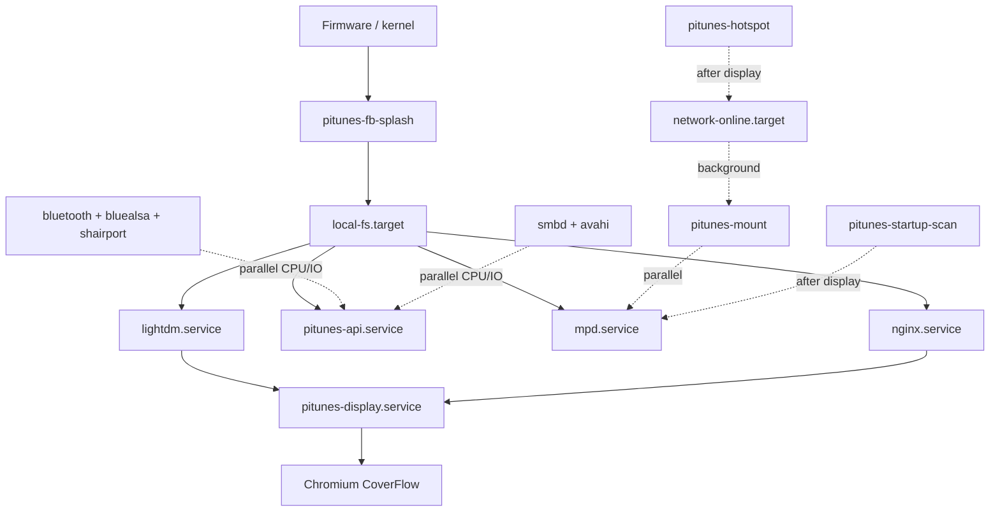

# PiTunes boot time analysis

Complete startup review for the PiTunes appliance image (Raspberry Pi OS Lite, kiosk + CoverFlow).

> **Measured numbers:** Run on your Pi — this document is built from unit files, scripts, and typical Pi 4 / SD-card behaviour. Replace estimates with real data:
>
> ```bash
> sudo /opt/pitunes/scripts/boot-performance-report.sh
> systemd-analyze
> systemd-analyze blame | head -40
> systemd-analyze critical-chain
> systemd-analyze critical-chain pitunes-display.service
> ```

---

## 1. Startup sequence (what actually runs)

### Phase A — Firmware & kernel (before systemd)

| Step | Source | Notes |
|------|--------|-------|
| GPU firmware | `config.txt` | `disable_splash=1` — no rainbow square |
| Kernel boot | `cmdline.txt` | `quiet loglevel=0 logo.nologo` — hidden messages |
| Root mount | kernel | ext4 on SD |

### Phase B — Early systemd (`sysinit.target`)

| Unit | Type | Blocking? |
|------|------|-----------|
| `pitunes-fb-splash.service` | oneshot | **~0.2–0.5 s** — paints `/dev/fb0`, then exits |
| Plymouth (if old image) | — | **Must be masked** — was 2–8 s + hang risk |

### Phase C — Core OS (`basic.target` → `multi-user.target`)

| Unit | After / wants | Typical cost |
|------|----------------|--------------|
| `systemd-udev-trigger` | — | 0.5–2 s |
| `NetworkManager.service` | — | 3–8 s |
| `NetworkManager-wait-online.service` | → `network-online.target` | **0–30+ s** (biggest variable) |
| `userconfig.service` | first image boot only | 1–5 s once |
| `pitunes-firstboot.service` | once | 1–3 s (`ssh-keygen -A`) |
| `hciuart.service` | BT firmware | 0.5–2 s |
| `bluetooth.service` | — | 1–3 s |
| `pitunes-bluetooth-discoverable.service` | after BT | &lt;0.5 s |
| `pitunes-bt-agent.service` | after BT | &lt;0.5 s |
| `bluealsa.service` | — | 0.5–1 s |
| `pitunes-bluealsa-aplay.service` | BT + bluealsa | &lt;0.5 s |
| `nqptp.service` | AirPlay timing | 0.3–1 s |
| `shairport-sync.service` | network | 0.5–2 s |
| `avahi-daemon.service` | — | 0.5–1.5 s |
| `smbd.service` / `nmbd.service` | — | 1–3 s |
| `ssh.service` | — | 0.5–1 s |
| **`pitunes-hotspot.service`** | After display + NM | 0–6 s WiFi nudge (off CoverFlow path) |
| **`pitunes-mount.service`** | `local-fs` only (parallel) | 1–5 s USB scan; NAS remounts when LAN is up |
| `mpd.service` | `local-fs` (no mount gate) | 1–3 s |
| **`pitunes-api.service`** | `local-fs`, Wants `mpd` | 1–3 s Python |
| `nginx.service` | — | 0.3–0.8 s |
| `pitunes-startup-scan.service` | after mpd | 0–60+ s if library empty (mpc update) |

### Phase D — Graphical (`graphical.target`)

| Unit | After | Typical cost |
|------|-------|--------------|
| `lightdm.service` | — | 2–5 s (X server) |
| **`pitunes-display.service`** | lightdm, nginx (not API/network) | see below |

### Phase E — `pitunes-display.sh` (CoverFlow visible)

| Step | Script behaviour | Typical cost |
|------|------------------|--------------|
| Wait for X socket | `while` + `sleep 1` | 0–3 s |
| Black background | `xsetroot` | &lt;0.1 s |
| Wait for nginx | `curl /` loop, **sleep 0.2** | 0–2 s if nginx slow |
| Chromium kiosk | cold start + GPU | **4–12 s** |

---

## 2. Complete boot timeline (estimated)

Typical **Pi 4 + Ethernet + USB music + golden image** (no Plymouth):

```text
 0s   Power on
 4s   Kernel handoff to systemd
 5s   pitunes-fb-splash (logo on HDMI)
 8s   NetworkManager up
 8s   nginx + pitunes-api + mpd (parallel, no network-online wait)
 9s   pitunes-mount (parallel USB scan)
11s   lightdm / X11
12s   pitunes-display starts
13s   nginx serves static UI
18s   Chromium first paint — CoverFlow visible
     network-online + NAS mount + startup-scan run in background
     pitunes-startup-scan may still run in background
```

**Slow paths:**

| Condition | Extra delay |
|-----------|-------------|
| WiFi station join at boot | +3–15 s on `network-online` |
| No Ethernet, hotspot watch | +0–6 s WiFi nudge |
| NAS music (`storage_source=network`) | mount waits for network + CIFS |
| First boot (`firstboot`, `userconfig`) | +2–8 s |
| Empty MPD DB → `startup-scan` | +5–120 s CPU/IO (parallel) |
| Old Plymouth enabled | +2–8 s, possible hang |
| Slow SD card | +3–10 s across all phases |

---

## 3. Critical chain to CoverFlow UI



**Hard gates for CoverFlow:**

1. `local-fs.target` → `nginx` (static UI)
2. `lightdm` → X11 socket
3. `pitunes-display.sh` → `http://127.0.0.1/` → Chromium (library API loads in-page)

---

## 4. Bottlenecks (ranked by impact)

| Rank | Bottleneck | Where | Est. cost | On critical path? |
|------|------------|-------|-----------|-------------------|
| 1 | **`network-online.target`** | NAS mount / WiFi only | 0–30 s | **No** (off CoverFlow path since install) |
| 2 | **Chromium cold start** | `pitunes-display.sh` | 4–12 s | **Yes** (UI visible) |
| 3 | **lightdm / X startup** | graphical.target | 2–5 s | **Yes** |
| 4 | **Library scan** | `pitunes-startup-scan` | 5–120 s | No (but steals IO) |
| 5 | **Samba + Avahi** | `smbd`, `nmbd`, `avahi` | 2–4 s | No (CPU/IO contention) |
| 6 | **Bluetooth stack** | hciuart → BT → bluealsa | 2–5 s | No (required for BT audio) |
| 7 | **WiFi station nudge** | `pitunes-hotspot` `wait_for_station_boot` | 0–6 s | No (starts after display) |
| 8 | **nginx poll interval** | `sleep 0.2` in display script | up to ~0.2 s | Yes |
| 9 | **First boot** | `firstboot`, `userconfig` | 2–8 s once | Once |
| 10 | **Plymouth (legacy)** | cmdline `splash` | 2–8 s | Removed in current setup |

---

## 5. `systemd-analyze` — what to look for

On the Pi, after boot:

```bash
systemd-analyze
# Example: Startup finished in 22.341s (kernel 4.512s + userspace 17.829s)

systemd-analyze blame | head -25
# Expect top entries may include:
# - NetworkManager-wait-online.service
# - mpd.service
# - lightdm.service
# - pitunes-mount.service
# - shairport-sync.service
# - smbd.service
# - systemd-udev-settle (if present)

systemd-analyze critical-chain pitunes-display.service
# Shows ordered path to CoverFlow service
```

Save output with:

```bash
sudo /opt/pitunes/scripts/boot-performance-report.sh
```

---

## 6. Service disposition matrix

| Service | Action | Saves (est.) | Safe? |
|---------|--------|--------------|-------|
| **Plymouth units** | **Mask** | 2–8 s | Yes |
| **`pitunes-mount` → drop `network-online`** | **Delay / change wants** (USB/local only) | 1–30 s | Yes if no NAS boot mount |
| **`pitunes-startup-scan`** | **Delay** after `pitunes-display` | 0 s wall; **5–60 s perceived** | Yes |
| **`pitunes-hotspot`** | **Delay** after display (Ethernet-only images) | 0–6 s | Yes if always on Ethernet |
| **`smbd` / `nmbd`** | **Delay** 15–30 s or disable + enable in Settings | 1–3 s | Yes (re-enable for SMB) |
| **`avahi-daemon`** | **Delay** after display | 0.5–1.5 s | Caution — AirPlay discovery uses mDNS |
| **`ssh.service`** | Disable if unused | 0.5–1 s | Optional |
| **`NetworkManager-wait-online`** | Lower timeout (`NM_WAIT_ONLINE_TIMEOUT=15`) | caps worst case | Yes |
| **Chromium cache wipe** | Stop deleting cache every boot | 1–3 s | Yes |
| **Display API poll** | `sleep 0.2` instead of `1` | up to ~1 s | Yes |
| `mpd`, `pitunes-api`, `nginx` | **Keep** | — | Required |
| `lightdm`, `pitunes-display` | **Keep** | — | Required |
| `bluetooth`, `bluealsa`, `pitunes-bt-agent`, `pitunes-bluealsa-aplay` | **Keep** | — | Required for BT |
| `shairport-sync`, `nqptp` | **Keep** | — | Required for AirPlay |
| `pitunes-bluetooth-discoverable` | **Keep** | — | Required for pairing |
| `pitunes-fb-splash` | **Keep** | — | &lt;0.5 s, no Plymouth |

---

## 7. Prioritised action plan

### P0 — Highest impact (do first)

| # | Action | Est. savings | Effort |
|---|--------|--------------|--------|
| 1 | Confirm Plymouth masked + no `splash` in cmdline | 2–8 s | Run `setup-boot-splash.sh` |
| 2 | USB/local music: remove `network-online` wait from `pitunes-mount` | 1–30 s | **Done** in `systemd/pitunes-mount.service` |
| 3 | Move `pitunes-startup-scan` after `pitunes-display` | 5–60 s perceived | **Done** in `systemd/pitunes-startup-scan.service` |

### P1 — High impact

| # | Action | Est. savings | Effort |
|---|--------|--------------|--------|
| 4 | Ethernet-only: start `pitunes-hotspot` **after** display, remove `Before=api` | 0–6 s + less contention | **Done** in `systemd/pitunes-hotspot.service` |
| 5 | Cap `NetworkManager-wait-online` timeout (15 s) | avoids 30+ s hangs | **Done** in `config/systemd/.../pitunes-timeout.conf` |
| 6 | Stop wiping Chromium cache on every boot in `pitunes-display.sh` | 1–3 s | **Done** (version stamp) |

### P2 — Medium impact

| # | Action | Est. savings | Effort |
|---|--------|--------------|--------|
| 7 | Defer `smbd`/`nmbd` with systemd timer (30 s after boot) | 1–3 s | Timer unit |
| 8 | Wait for nginx (not API) + 0.2 s poll in `pitunes-display.sh` | up to ~1 s | **Done** |
| 9 | `systemd-analyze` on hardware → tune top 3 blame entries | varies | Measurement |

### P3 — Lower impact / optional

| # | Action | Est. savings | Effort |
|---|--------|--------------|--------|
| 10 | Disable `ssh.service` if not needed | 0.5–1 s | `systemctl disable` |
| 11 | Use faster SD / USB boot media | 3–10 s global | Hardware |
| 12 | Pre-warm Chromium profile in image golden state | 1–2 s | Image build |

---

## 8. Boot ordering (built into `install.sh`)

CoverFlow no longer waits on `network-online`, `mpd`, or `/api/health`. Re-run `install.sh` or copy these units on upgraded images:

| File | Effect |
|------|--------|
| `systemd/pitunes-mount.service` | Mount after `local-fs` only |
| `systemd/pitunes-api.service` | API after `local-fs`, `Wants=mpd` (not `Requires`) |
| `systemd/pitunes-display.service` | Display after `nginx` + `lightdm`, not `pitunes-api` |
| `systemd/pitunes-hotspot.service` | Hotspot after display |
| `systemd/pitunes-startup-scan.service` | Scan after display |
| `config/systemd/mpd.service.d/pitunes-boot.conf` | MPD without network/mount gate |
| `config/systemd/nginx.service.d/pitunes-boot.conf` | nginx without `network-online` |
| `scripts/pitunes-display.sh` | Wait for nginx `/`, 0.2 s poll, keep Chromium cache |

**NAS music:** CIFS/NFS mount may fail until LAN is up; run `sudo systemctl restart pitunes-mount.service` after network connects, or use Settings → storage refresh.

---

## 9. Expected totals after optimisation

| Profile | Before (est.) | After P0–P1 (est.) |
|---------|---------------|---------------------|
| Pi 4, Ethernet, USB music | 22–28 s to CoverFlow | **14–18 s** |
| Pi 4, WiFi only, first boot | 35–55 s | **25–40 s** |
| Pi 3 / slow SD | 35–50 s | **22–35 s** |

Run `boot-performance-report.sh` before and after each change on the **same hardware** to record real deltas.

---

## 10. Constraints checklist

| Requirement | Status |
|-------------|--------|
| Bluetooth works | Keep full BT chain |
| AirPlay works | Keep `shairport-sync` + `nqptp`; defer Avahi with care |
| Audio playback | Keep `mpd` + mount (may relax network wait) |
| CoverFlow UI | Keep `lightdm` + `pitunes-display`; optimise waits only |

See also: [BOOT_SPLASH.md](BOOT_SPLASH.md), [BOOT_PERFORMANCE.md](BOOT_PERFORMANCE.md).
